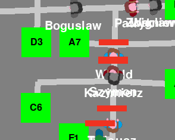
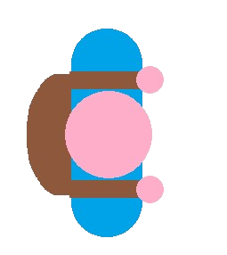
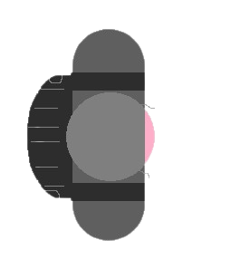
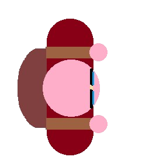

# 🎓 PES – Ekosystem Studencki

---

## 📦 Wymagania

Wszystkie niezbędne biblioteki i zależności opisane są w pliku `requirements.txt`.

---

## 🧠 Jak działa program?

Na mapie uczelni w naszej symulacji, mamy budynki i ścieżki, oraz studentów różnych rodzaji. Całośc bundynków jest połączona na mapie poprzez ścieżki i punkty kontronlne na zakrętach/rozwidleniach. Całość tworzy graf - nazwijmy go grafem mapy - GM.
Studetnci poruszają sie po mapie idąc ścieżkami. Każdy student pod sobą ma wyświetloną swoja nazwę, a nad sobą ilość pozostałych punktów ECTs.

---

## ⏱️ Zasady symulacji

Jest okreslony czas do następnych zajęć uczelni. Na początku każdego cyklu student dostaje informacje gdzie ma nastepne zajęcia. Algorytm oblicza najlepszą trasę do wykazanego celu (budynku uczelni) - na grafie GM. Student zapamiętuje tę trasę, i punkt po punkcie się do niej kieruje z przypisaną mu prędkością (zależy to np. od kategori studenta). Gdy student znajduje się tam gdzie ma następne zajęcia przed końcem czasu, dostaje informacje o miejsu swoich następnych zajęć - gdy jednak nie dotrze na miejsce na czas trafi określoną liczbę punktów ECTs. Gdy student straci wszytkie punkty ECTs, zostaje wyrzucony z uczelni/muis zdawać za rok - czyli opada z mapy/umiera.

---

## 👨‍🎓 Kategorie studentów

### Świeżak (Freshman)

- Jeszcze nie wie gdzie są wszystkie budynki, trochę się gubi (niezbyt szybki)
- Dopiero co zaczął swoją przygodę na uczelni (dużo ECTs)

### Spadochroniarz (Droppeddown)

- Już wie gdzie co i jak (szybki)
- Ma do zaliczenia tylko kilka przedmiotów które uwalił (mało punktów ECTs)

### Kujon (Overachiever)

- Wkuł całą mapę uczelni na pamięć, i cały czas biega aby na pewno się nidgdzie nie spuźnić (bardzo szybki)
- Nigdy niczego jeszcze nie uwalił (dużo ECTs)

### Olewacz (Slacker)

- Niezby mu zależy aby gdziekolwiek na zajęcia zdążyć (bardzo powolny)
- Część już uwalił, część jeszcze nie (mało punktów ECTs)

